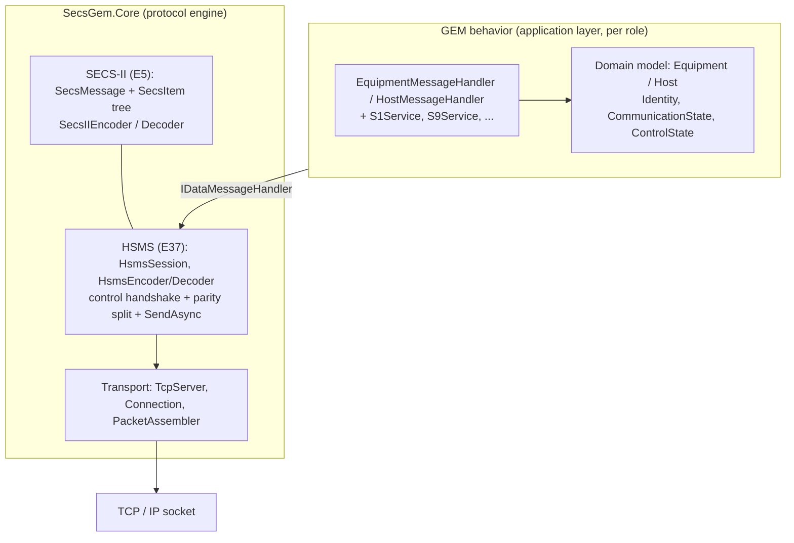
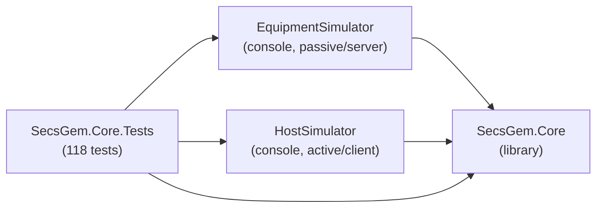
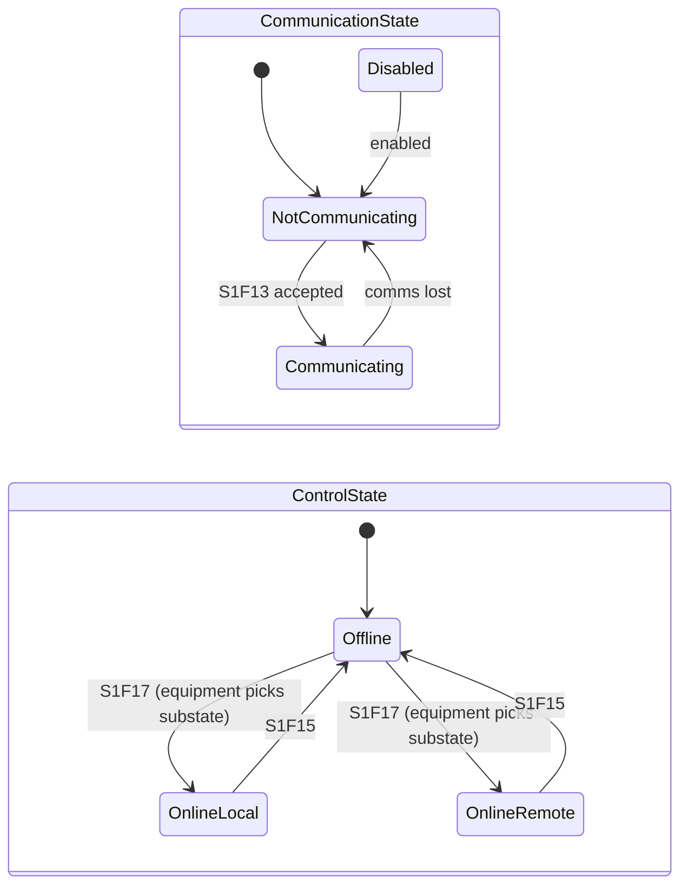

# EquipmentSimulator — Architecture

A note-to-future-self explaining how this SECS/GEM simulator is put together and *why*.
_Last updated: 2026-08-08_

> **TL;DR:** A reusable protocol engine (`SecsGem.Core`) handles bytes → HSMS → SECS-II and delegates
> *what a message means* to a per-role handler in the app layer. Two console apps (`EquipmentSimulator`,
> `HostSimulator`) plug their GEM logic into that engine. Domain models own state; services orchestrate.

---

## 1. The layered model

SECS/GEM is a stack. Each layer only knows about the one below it.



- **Transport** — raw TCP; `Connection` reads/writes bytes, `PacketAssembler` reassembles HSMS frames from the stream.
- **HSMS (E37)** — framing + the control handshake (Select/Linktest/Deselect/Separate) and the **primary/secondary split**. Knows nothing about GEM.
- **SECS-II (E5)** — the message *format*: `SxFy` headers + a self-describing item tree (List, ASCII, integers, binary…).
- **GEM (E30)** — the *behavior*: what each message means, and the state models. Lives in the **app** layer, not Core.

---

## 2. Projects & dependencies



| Project | Role | Key contents |
|---|---|---|
| **SecsGem.Core** | Reusable engine | `SecIIMessage/` (messages + codec), `Models/` (HsmsMessage, SecsItem, enums), `HSMS/` (session, codec, assembler), `Transport/` (TcpServer, Connection), `Events/`, `Interfaces/IDataMessageHandler`, `Equipment/` & `Host/` domain models, `Formatter/SMLFormatter` |
| **EquipmentSimulator** | The tool (passive) | `Program.cs` (config → builds `Equipment` + `TcpServer`), `GemEquipment/` (`EquipmentMessageHandler`, `S1Service`, `S9Service`) |
| **HostSimulator** | The factory host (active) | `Program.cs`, `HostTcpConnection`, `GemHost/` (`HostMessageHandler`, `S1Service`, `S9Service`) |
| **SecsGem.Core.Tests** | Safety net | `HsmsTestCases/` (transport + e2e), `HandlerTestCases/` (GEM behavior), codec + formatter tests |

---

## 3. Key design decisions (the "why")

1. **Core is GEM-agnostic; behavior is injected via `IDataMessageHandler`.**
   `HsmsSession` never hard-codes `S1F13`. On an incoming *primary* it calls `handler.Handle(message)`.
   The equipment and host each supply their own handler. This is why Core is reusable and why adding
   a message doesn't touch the session.

2. **Primary/secondary parity split** (`HsmsSession.ProcessMessage`):
   *odd function = request* → goes to the handler, its reply is framed and sent.
   *even function = reply* → passed straight through to whoever's awaiting it (via `SendAsync`). **Never** route a reply through the handler.

3. **Request/reply correlation by SystemBytes.** `SendAsync` sends a primary and waits for the reply whose SystemBytes match (the equipment echoes them). Reply-less notifications (S9) carry no W-bit.

4. **Domain models own state; services orchestrate.** `Equipment`/`Host` hold `Identity`, `CommunicationState`, `ControlState`. `S1Service` etc. *read and update* those — they never store business state themselves. This keeps the growing set of services (S1/S2/S5/S6…) thin.

5. **Config lives in the app layer only.** `Program.cs` reads `appsettings.json` and builds the domain model. Core takes plain objects — it never depends on a config framework.

6. **One source of truth for identity.** Device id lives on `Identity`; state objects read it from there.

---

## 4. Message flow — worked example (host establishes comms)

```mermaid
sequenceDiagram
    participant HS as Host S1Service
    participant HSess as Host HsmsSession
    participant Net as TCP
    participant ESess as Equip HsmsSession
    participant EH as EquipmentMessageHandler
    participant EM as Equipment (model)

    HS->>HSess: SendAsync(S1F13)
    HSess->>HSess: EnsureSelected() (Select handshake if needed)
    HSess->>Net: encode + write S1F13 (W, SystemBytes=N)
    Net->>ESess: bytes -> assemble -> decode
    ESess->>ESess: ProcessMessage: odd fn => primary
    ESess->>EH: Handle(S1F13)
    EH->>EM: check CommunicationState, device id
    EM-->>EH: enabled + valid
    EH-->>ESess: S1F14 (COMMACK=0, identity); model -> Communicating
    ESess->>Net: encode + write S1F14 (SystemBytes=N)
    Net->>HSess: bytes -> assemble -> decode
    HSess->>HSess: ProcessMessage: even fn => secondary (pass-through)
    HSess-->>HS: SendAsync returns S1F14
    HS->>HS: validate COMMACK == Accepted
```

The same shape covers S1F1/F2, S1F15/F16, S1F17/F18 — only the handler branch and the state it touches differ.

---

## 5. State models



- **CommunicationState** gates whether GEM traffic is allowed. Driven by S1F13.
- **ControlState** gates *who may operate* the tool. Host drives Online/Offline (S1F17/S1F15); the **equipment** chooses Local vs Remote (`DefaultOnlineState`). The host only *observes* the substate (via status/events — not yet built), which is why the host model may hold a `Pending`.

---

## 6. How to add a new `SxFy` (future me, read this)

1. **Message class** — add a `SecsMessage` subclass in `SecsGem.Core/SecIIMessage/SecsMessage.cs`.
   Set `Stream`, `Function`, `Waitbit`, `Payload`. ⚠️ A **reply** uses the **even** function and **`Waitbit => false`** (the S1F16/S1F18 bug was a reply with the wrong function number — this is the trap).
2. **Behavior** — add a `HandleSxFy` in the right `SxService` (equipment or host). Read/update the **domain model**; don't stash state in the service.
3. **Route it** — add the `case` in `EquipmentMessageHandler` / `HostMessageHandler` (stream → function switch). Unknown stream → S9F3, unknown function → S9F5, bad payload → S9F7 (all via `S9Service`, which builds the MHEAD).
4. **Test it** — add a behavior test in `HandlerTestCases`; add an end-to-end test in `HsmsTestCases` if it's a notable flow.
5. **Document it** — add the row to [`SECS_CHEATSHEET.md`](SECS_CHEATSHEET.md) and move it out of the roadmap.

---

## 6a. The golden-vector rule (conformance testing)

Anything that touches the **wire** (SECS-II item encode/decode, the HSMS header, S9 MHEAD) must be tested with **golden vectors**: hand-verified, SEMI-standard byte arrays — *not* values captured from our own encoder.

**Why:** a round-trip test (`encode → decode → assert value`) passes as long as the encoder and decoder *agree with each other*, so any bug they **share** is invisible. That is exactly how the W-bit-in-the-wrong-byte and the off-by-one length-byte-count survived for so long — every round-trip test was green while the bytes on the wire were wrong. Golden vectors compare against the *standard*, so a shared bug fails loudly.

**Rules:**
- Assert exact bytes against a hand-derived vector (e.g. `A "AB"` → `41 02 41 42`; `S1F13 W` header byte 2 = `0x81`, byte 3 = `0x0D`).
- Never "fix" a golden test by pasting in the actual output — re-derive from the standard first; if they differ, the *code* is probably wrong.
- Keep at least one golden test per item type, per header field, and per S9 MHEAD.
- Round-trip/symmetry tests are still useful (they catch asymmetric bugs), but they are **not** a substitute for goldens.

Home: `EncodeSecIITestCases` / `DecodeSecIITestCases` (item goldens), `HsmsTestCases` (header goldens), `HandlerTestCases` (S9 MHEAD goldens).

---

## 7. Known gaps / deferred (so future me remembers the trade-offs)

- **`SendAsync` correlation is single-slot + polling** — fine for one transaction at a time; a `TaskCompletionSource`-keyed transaction manager is needed once the **equipment** initiates (S6F11 events) and traffic becomes concurrent.
- **`HostMessageHandler` returns a safe default** — real host-side primary handling arrives with events (S6F11).
- **No HSMS timers (T3/T5/T6/T7/T8) yet** — timeouts are a fixed poll.
- **No GEM data layer yet** — SV/DV/EC, reports, events, alarms, GEM300 are all future.

See `SECS_CHEATSHEET.md` for the live message-by-message status.
